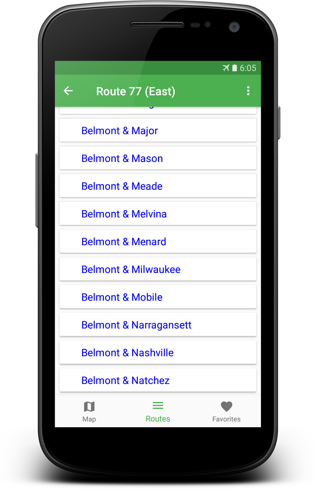
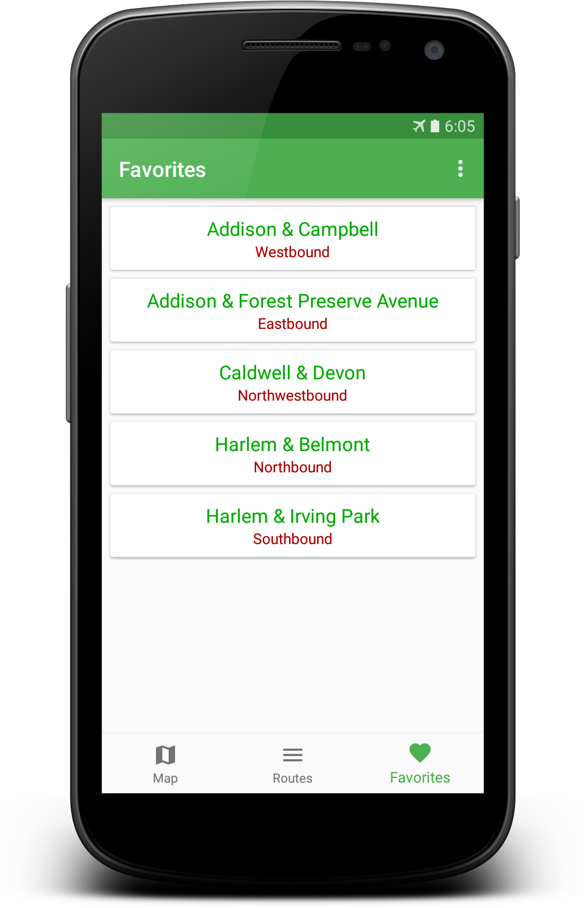

# Times via Text
Times via Text is a CTA bus tracking app - but not just any CTA bus tracking app.
Times via Text works *entirely offline* (once it's downloaded the map tiles it needs).
It's able to do this by using the CTA's [Bus Tracker by Text](http://www.transitchicago.com/riding_cta/how_to_guides/bustrackertext.aspx).

Data provided by [Chicago Transit Authority](http://transitchicago.com).

[DB Browser for SQLite](https://github.com/sqlitebrowser/sqlitebrowser) was used during development.

## Screenshots

| Map | Stop list | Favorites |
|:-:|:-:|:-:|
 |  | 

## Dependencies

* [osmdroid](https://github.com/osmdroid/osmdroid)
* [Android SQLiteAssetHelper](https://github.com/jgilfelt/android-sqlite-asset-helper)

## Building

To keep the repository from getting needlessly large, the master branch no longer includes the necessary database.

To build immediately, use a branch with a name in the format YYYY-MM-DD.

Otherwise, you must create the database as specified in `DATABASE_CREATION.md`.
